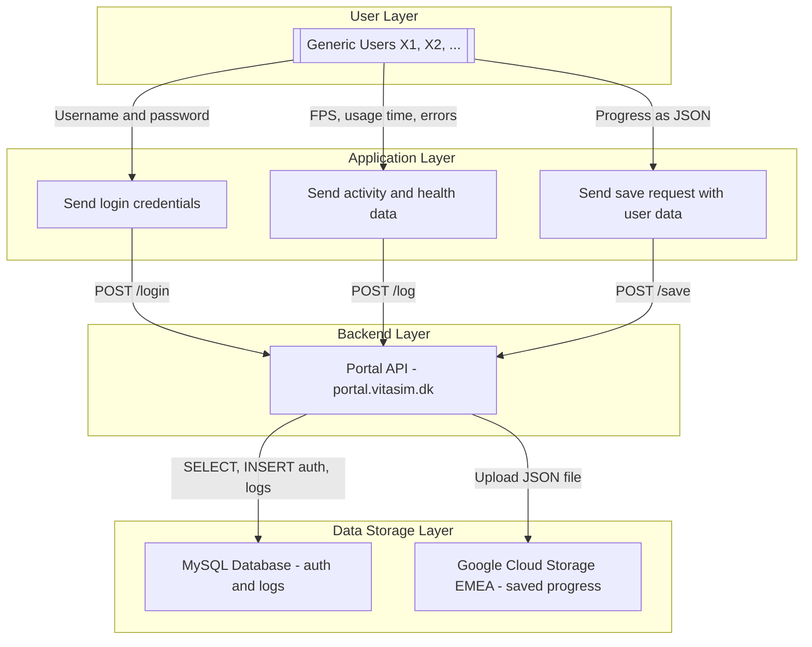

## **Introduction**

The X-ray Simulator is an advanced X-ray simulation software designed to support educational institutions in providing high-quality training for radiologic technology students. This guide addresses key security, compliance, and technical considerations for IT and security personnel evaluating the solution.

## **Business Purpose & Functionality**

### **What is the X-ray Simulator?**

The X-ray Simulator is a virtual training platform that allows educators to simulate real-world X-ray imaging scenarios. It enhances student learning through interactive exercises, and risk-free guided training.

#### **Key Features:**

* Realistic X-ray simulation for student training
* Interactive image acquisition and positioning
* Scalable platform for individual and classroom use
* Secure locally installed software with online license authentication

## **Common Questions:**

### Who would our direct contact be for support/assistance?
Support is provided through the options listed [here](/Support/support), and reference guides and documentation can be found on [The support page](/welcome). Support is available during the times listed on the website.

### Is the software cloud-based?
No, the X-ray Simulator is a self-contained desktop-based software that requires installation on a PC. However, it does use the internet for license authentication during login.

### Does the software integrate with any other systems?
No, the X-ray Simulator does not integrate with external systems. It is a standalone application that must be installed on a PC. 

### What types of data are collected and stored in the X-ray Simulator?
The software does **not** store any personal data (PII). Instead, it uses **“dump” users** that institutions can distribute to students. The data collected includes:

* **Logging of activity**, such as login time and application performance metrics (e.g., FPS).
* **Simulation progress** should a user choose to save their progress for future sessions.

### What is a "dump" user, and why does the X-ray Simulator use them?
A "dump" user is a generic, non-personalized account provided to institutions to assign to students. Instead of tracking individual users, the X-ray Simulator allows institutions to manage access through pre-set accounts (e.g., User X1, X2, etc.), ensuring that no personally identifiable information (PII) is stored within the system. These accounts can be reset or reassigned as needed.

### Does the X-ray Simulator require an internet connection to function?
The software only requires an internet connection for user authentication upon login.
Logging happens frequently during sessions, however they are nto mandatory and loss of connection after login will not disturb operations. 

### What are the hardware requirements for using the X-ray Simulator?
The X-ray Simulator requires a PC that adhere to the requirements below for optimal performance. 
The VR version also requires a compatible tethered VR headset. 
Institutions should ensure that their hardware meets the system requirements before installation.

* For **VR hardware requirements**, visit: [Minimum Requirements for VR the X-ray Simulator](/Tech/minimum-requirements-for-running-the-vr-xray-simulator)
* For **Desktop hardware requirements**, visit: [Minimum Requirements for Desktop the X-ray Simulator](/Tech/minimum-requirements-for-running-the-desktop-xray-simulator)

### How are users managed within the X-ray Simulator?
Institutions receive a set of **“dump” user accounts** (e.g., X1, X2, etc.), which can be assigned to students as needed. 
These accounts do not store personal data and can be reset upon request.

### Does the X-ray Simulator support role-based access?
No, the X-ray Simulator operates on a simple user authentication model. 
A user either has access or does not—there are no distinct roles or permission levels within the system.

### How is the X-ray Simulator installed and managed on institutional computers?
The software requires **administrator privileges** for installation on institutional PCs. 
The software supports MDM deployment. 
Once installed, students can access it using the provided credentials.
Read more on the [setup page](/Tech/Setup-and-installation-guides/VR-X-ray-Simulator-Setup)

### How does the X-ray Simulator handle access control?
Access control is managed at the institutional level by assigning user credentials. 
The X-ray Simulator does not have internal user role-based permissions.

## **Data Handling & Security**

### **Does the X-ray Simulator store or process sensitive data (ePHI, PII, financial information)?**

No. The X-ray Simulator does not collect, store, or process electronic protected health information (ePHI), personally identifiable information (PII), or financial data. The system operates solely with "dump user" and simulated data.

#### **How does the X-ray Simulator ensure data security?**

* **Encryption**: All data transmissions related to authentication are encrypted using industry-standard protocols.
* **Access Management**: Institutions control user access through assigned credentials.
* **Data Governance**: No PII data is processed or stored within the application.
* **Audit Logging**: The system maintains detailed logs to track user activity for compliance and security monitoring.

## **Hosting & Compliance**

### **Is the X-ray Simulator hosted externally or on-premises?**

The X-ray Simulator is a locally installed desktop application. It does require an internet connection to authenticate the user license upon login, but all other operations are performed offline.

### **What security measures are in place for the solution?**

* The X-ray Simulator does not store personal data, ensuring compliance with institutional privacy policies.
* All authentication requests are securely encrypted to prevent unauthorized access.
* The system logs user activity and performance data for troubleshooting and optimization.

### Can you provide a data flow diagram of the infrastructure. 
Yes. Here is the simplified data flow diagram. 

## **Institutional Integration & Deployment**

### **Which institutions and departments use the X-ray Simulator?**

The X-ray Simulator is used by:

* Radiologic technology training programs

### **How does the X-ray Simulator integrate with an institution's existing infrastructure?**

* **User Authentication**: the X-ray Simulator requires login authentication but does not integrate with external identity management systems.
* **Standalone Operation**: The software does not require integration with Learning Management Systems (LMS) or hospital IT networks.
* **IT Support**: Dedicated support is available for onboarding and technical troubleshooting.

### **User Management**

The X-ray Simulator uses a system of **predefined user accounts**, where institutions are provided with a set of usernames and passwords (e.g., User X1 with password X1, User X2 with password X2, etc.). These accounts can be distributed to students as needed. This approach offers several advantages:

* No personal user data is collected or stored.
* Accounts can be easily reset upon request.
* Simplified user management with no need for role-based access or individual account creation.

For further inquiries or technical support, please contact our IT security team at **support@vitasim.dk**.